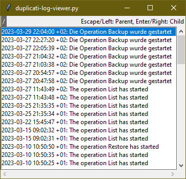
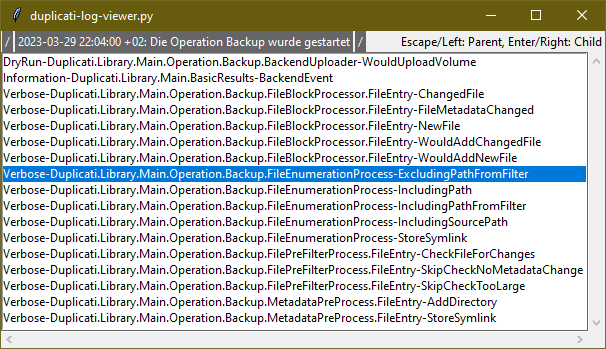
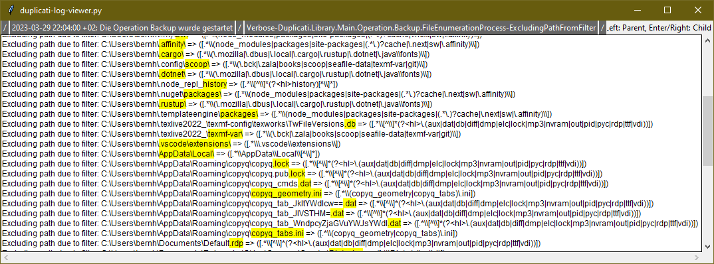

# duplicati-log-viewer

Python script for browsing [Duplicati](https://www.duplicati.com/) log files.

## Features
- Hierarchical structure
  1. Overview
  2. Tags (changed/new files, excludes, includes, ...)
  3. list of files
- highlight exclude patterns (denoted by a matching group named "hl" (`(?<hl>...)`) or by stripping of a leading `.*[/\\\\]` pattern)





## Installation/Requirements
1. Python3
2. PyYAML
```
pip3 install -r requirements.txt
```
